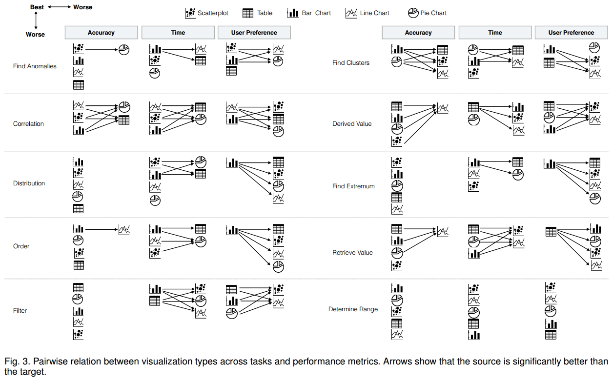
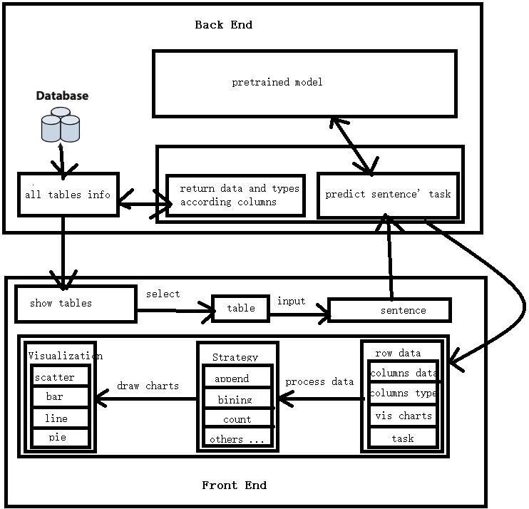

[TOC]

# freeNLI

### nlp to vis charts


### Setup

#### Requirements
For training the [multi-label classification](https://towardsdatascience.com/multi-label-classification-using-bert-roberta-xlnet-xlm-and-distilbert-with-simple-transformers-b3e0cda12ce5) model, 
you need to create a new virtual environment and install packages using conda:
+ `conda create -n simpletransformers python=3.6 pandas tqdm`
+ `conda activate simpletransformers`
+ `conda install pytorch cpuonly -c pytorch`
+ `conda install -c anaconda scipy`
+ `conda install -c anaconda scikit-learn`
+ `pip install transformers`
+ `pip install seqeval`
+ `pip install tensorboardx`
+ `pip install simpletransformers`

Apart from the above packages, you should install additional packages to run the FreeNLI system:  
> Python == 3.6 
  Django >= 3.0  
  django-cors-headers  
  xlrd
  lxml

#### Pretrained Model
Our pretrained model (`pytorch_model.bin`) can be downloaded from [Google Drive](https://drive.google.com/file/d/1ZWYstMRhGe4dW9EuOASr1Mwz9ecMgNcl/view?usp=share_link).
Please place it (`pytorch_model.bin`) into the directory `model/roberta/`.

#### Startup
Startup FreeNLI:
`python manage.py runserver 0.0.0.0:80`
Now the system is running on your [localhost](http://localhost/).

### System Architecture



### layering

Note: Data can only be a column name, not a value. So if your sentence is considering a table value, please use brackets to indicate it's column name. E.g.  What's the GDP of China (Country)?

Data Type: **C**: Category, **N**: Numerical

Strategy: **a**: append (append one more column, *default*), **b**: bining, **c**: count, **s**: sort (in **a**lphabetical or **n**umerical order), max, min, average (those three strategies are applied for task  0, 3, 4), mean ( it calculates the mean value for each category (xAxis value)  and is applied for task 6, 10).

swap: detect all columns to find a numerical type column, use this column as the first column.

| Task \ Data                     | C           | N        | NC          | CC           | NN        |
| ------------------------------- | ----------- | -------- | ----------- | ------------ | --------- |
| **0.Others**                    | A, a: NC>P  | A, P     | A, P        | A, a: NCC>P  | A, P      |
| **1.Retrieve Value**            | A, a: NC>P  | A, P     | A, P        | A, a: NCC>P  | A, P      |
| **2.Filter**                    | A, a: NC>P  | A, P     | A, P        | A, a: NCC>P  | A, P      |
| **3.Compute Derived Value**     | c: NC>AP    | b: NC>AP | A, P        | c: NCC>AP    | b: NCN>AP |
| **4.Find Extremum**             | c: NC>AP    | sn: A, P | sn: A, P    | c: NCC>AP    | sn: A, P  |
| **5.Sort**                      | sa: A, NC>P | sn: A, P | sn: A, P    | sa: A, NCC>P | sn: A, P  |
| **6.Determine Range**           | c: NC>AP    | sn: A, P | sn: A, P    | c: NCC>AP    | sn: A, P  |
| **7.Characterize Distribution** | c: NC>AP    | b: NC>AP | b: NCC>A, P | c: NCC>AP    | b: NCN>AP |
| **8.Find Anomalies**            | c: NC>AP    | b: NC>AP | A, P        | A, a: NCC>P  | A, P      |
| **9.Cluster**                   | c: NC>AP    | b: NC>AP | A, P        | A, a: NCC>P  | A, P      |
| **10.Correlate**                | A, a: NC>P  | A, P     | A, P        | A, a: NCC>P  | A, P      |

For A: count>swap>sort, bin>swap

For P: count>sort

Scatter, bar, line chart have the same strategy,  while pie chart is different of them.

Scatter, bar, line chart: A (X, Y);   Pie chart: P (V, L) legend: tooltip

| Chart \ Data | C    | N    | NC   | CC   | NN   |
| ------------ | ---- | ---- | ---- | ---- | ---- |
| **AX**       | C    | N    | C    | C    | N    |
| **AY**       |      |      | N    | C    | N    |
| **PV**       |      | N    | N    |      | N    |
| **PL**       |      |      | C    |      | N    |

### Download Access Log
+ [log_freenli.csv](https://freenli.projects.zjvis.org/static/table/log_freenli.csv)
+ [log_homepage.csv](https://freenli.projects.zjvis.org/static/table/log_homepage.csv)
+ [log_api.csv](https://freenli.projects.zjvis.org/static/table/log_api.csv)

### API
URL: `https://freenli.projects.zjvis.org/get_sentences_tasks`  
Methods: `GET` or `POST`  
Params:

+ name: `sentences`
+ value: A **string array** of sentences which need to be predicted.
Example: 
```python
import requests, json

url = "https://freenli.projects.zjvis.org/get_sentences_tasks"
sentences = ["In the sixtieth ceremony, where were all of the winners from?",
            "List center-backs by what their transfer_fee was.",
            "show the way the number of likes were distributed."]
payload = {'sentences': json.dumps(sentences)}

r = requests.get(url, params=payload)
# r = requests.post(url, data=payload)

print(r.status_code)  # 200
print(r.json()["tasks"])  # "[[2, 6], [5], [7]]"
```

